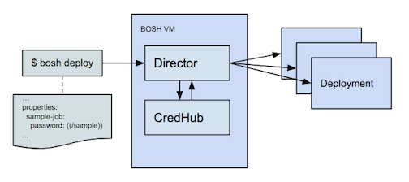

# BOSH Config Server Integration

### Description

BOSH deployments are created and managed via BOSH deployment manifests. These artifacts contain all of the information, both configurations and credentials, needed to deploy one or many VM instances and services. A BOSH operator is responsible for creating, managing and controlling these manifests so that a deployment can be created, modified or recreated in another environment. Deployment manifests are often shared by release authors and between users to reduce the complexity of deploying services, e.g. [cf-deployment][5] for deploying Cloud Foundry.

[5]:https://github.com/cloudfoundry/cf-deployment

### Motivation

A few common issues arise from this workflow.

* Manifests must be managed with same controls as credentials

    Operators want to be able to manage deployment manifests in the same way as other configuration files. They want to be able to check these files into source control so that they can collaborate and track changes over time. They also want to share or copy deployment manifests that contain common configurations. This is complicated by the fact that credentials exist in the deployment manifest alongside the configurations. An operator may accidentally push a manifest to a public repository, which discloses their deployment credentials.

    Similarly, all users and services that interact with deployment manifests must ensure that they are handling them appropriately to avoid disclosure of the contained credentials.

* Complexity of manually generating credential values

    A complex deployment, e.g. Cloud Foundry, contains dozens of variously typed credentials. Each of these credentials has its own generation parameters, such as the allowed character set, length, certificate extensions, signing CA, duration, etc. The overhead of manually generating and managing these credentials is a burden on the operator. This burden motivates operators to rotate credentials less often, resulting in long-lived credentials in the environment.

* Strongly tying credential and configuration management

    Configuration and credential management are different responsibilities, which may be managed by separate users or teams. Combining these two responsibilities into a single function does not work for all users. An operator should be able to focus on configuration without concern for the underlying credential values. Similarly, a user concerned with managing credentials should be able to provision and update these values transparently to an operator.

* Credential access is not controlled or audited

    Credentials should be controlled in such a way that only users and processes that require access are able to see their values. Auditors may also want to review who has accessed a credential value. This is not possible if the credentials are distributed as yml files.

The config server integration intends to solve the above issues, which will simplify the operator workflow and enhance the overall security of a BOSH environment.

### Implementation

#### Interpolation

The BOSH Director has been updated to perform interpolation of credential values into manifests that use the `((variables))` syntax. When the Director encounters a variable using this syntax, it will make requests to CredHub to retrieve the credential value. If the credential does not exist and the release or manifest contains generation properties, the value will be automatically generated. More information on generation properties can be [found here.](./credential-types.md#enabling-credhub-automatic-generation-in-releases)

This workflow allows an operator to deploy a manifest without being concerned about whether a credential exists or must be generated.

#### Namespacing

To prevent name collisions between deployments, the BOSH Director performs automatic namespacing of credentials. Variable names are prefixed with the director name and deployment name when retrieved or generated in CredHub. For example, a variable `((password))` in deployment `example-deployment` on director `bosh-director` will be retrieved and generated as `/bosh-director/example-deployment/password`. The same manifest with deployment name `deployment2` will be retrieved and generated as `/bosh-director/deployment2/password`. If you wish to escape the namespacing to share credentials between deloyments, you can simply start the credential with a / character. For example, `((/iaas-password))` is named as-is.

#### Property Accessors

CredHub credentials may contain multiple components in the response value, depending on [type](./credential-types.md). If you wish to use only a single component of a complex credential, you can do so using a dot syntax, like `((api-tls.certificate))`. This will return only the value of the `certificate` key from the `api-tls` credential object.

#### Pinning to Credential IDs

CredHub stores historical credential values when a credential is modified. When a deployment occurs, the Director's request to CredHub will return the latest credential value. This ensures that deployments use the latest value for a credential. Some non-user-initiated operations, such as scaling and resurrection, should not receive the latest value. These operations should use the same values as the original deployment, to avoid leaking credential changes during lifecycle events. To achieve this level of safety, the Director tracks each credential ID on deploy and retrieves by ID for these operatons. The credential ID is version specific, so it will always return the same value regardless of subsequent modifications.

### Configuration

The process to enable the config server integration is documented [here.][1] You can also review sample deployment manifests [here.][2] An ops file that includes only modifications to a standard BOSH Director deployment can be found [here.][3]

[1]:https://github.com/pivotal-cf/credhub-release/blob/master/docs/bosh-install-with-credhub.md
[2]:https://github.com/pivotal-cf/credhub-release/tree/master/sample-manifests
[3]:https://github.com/cloudfoundry/bosh-deployment/blob/master/credhub.yml
