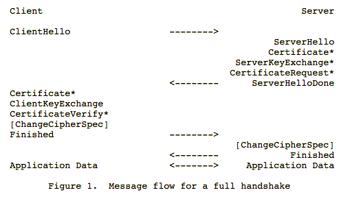

# Mutual TLS Client Authentication

### Description
Transport Layer Security (TLS) is a protocol for secure communications and authentication. A traditional one-way TLS connection authenticates the server, but not the client. For example, when you visit https://example.com your web browser authenticates the server by validating the certificate it presents. In a Mutual TLS connection, the client also provides a certificate, which asserts its identity to the server. 

### Motivation
Mutual TLS authentication is a secure method of authentication. Unlike a traditional password or token-based method, mutual TLS does not exchange a secret value during the authentication process. The client and server each present their certificate, which contains a public key, during the handshake. The public key is used to facilitate a key exchange for future communication. This exchange proves possession of the private key corresponding to the public key without disclosing the private key value. If the certificate is intercepted during the exchange, it cannot be used for authentication without possession of the private key.



_Source: [TLS Protocol RFC5246](https://tools.ietf.org/html/rfc5246)_

The secure properties of this method make it a compelling option for authentication. 

The primary downside of Mutual TLS is the requirement to maintain a PKI that securely manages trusted certificate authorities and properly verifies clients before issuing client certificates. However, much of this can be mitigated with the automation and orchestration provided by Cloud Foundry and CredHub. 

### Implementation

Our initial implementation of mutual TLS authentication will focus on application authentication. We decided to focus on this area first to enable the secure service credential workflow and future initiatives involving application credential management with CredHub. This implementation leverages the recent feature added to diego-release to place [instance identity][1] certificates in each application container. 

[1]:https://github.com/cloudfoundry/diego-release/blob/master/docs/instance-identity.md

The primary mechanism for validating that a client certificate is authentic and should be trusted for authentication is the signing CA. CredHub is configurable to allow any number of trusted CAs for the purpose of mutual TLS client certificate signing. If a client certificate is provided that has been signed by a certificate that is not included in the trusted CAs list, it will be rejected. 

In addition to validating the signature, the CA and client certificates must be within their issued validity dates and the client certificate must contain the extended key usage extension for client authentication. 

For each authentication mechanism that is accepted by CredHub, we must establish a primary identity based on the information asserted in the authentication token. The first phase of implementation will establish the application GUID as the primary identity for mutual TLS authentication. For this reason, all mutual TLS client certificates must contain an application GUID in the certificate organization unit in the format 'app:[v4-guid]'. Although not required, client certificates should also include an instance-specific identifier in the common name. Future phases will expand the allowed identifiers presented by a client certificate. 

### Configuration

Trusted mutual TLS CAs for CredHub are configured in the deployment manifest. All certificates signed by a CA included in the `trusted_cas` list will be trusted by CredHub for authentication. 

```
  - name: credhub
    release: credhub
    properties:
      credhub:
        authentication:
          mutual_tls:
            trusted_cas:
            - |
              -----BEGIN CERTIFICATE-----
              MIIDyzCCArOgAwIBAgIUUH9NMMgv8OC6vdGN0ul9fTzIBpMwDQYJKoZIhvcNAQEL
              ...
              9Y0zSr/HiQn6H6wMIifS
              -----END CERTIFICATE-----
```

To establish a successful mutual TLS handshake, TLS termination must be performed at the CredHub application. This requires an architecture that provides passthrough load balancing to the deployed CredHub instances. For example, routing through the Cloud Foundry router or an external TLS-terminating load balancer is not possible if you wish to use mutual TLS authentication for clients. 
