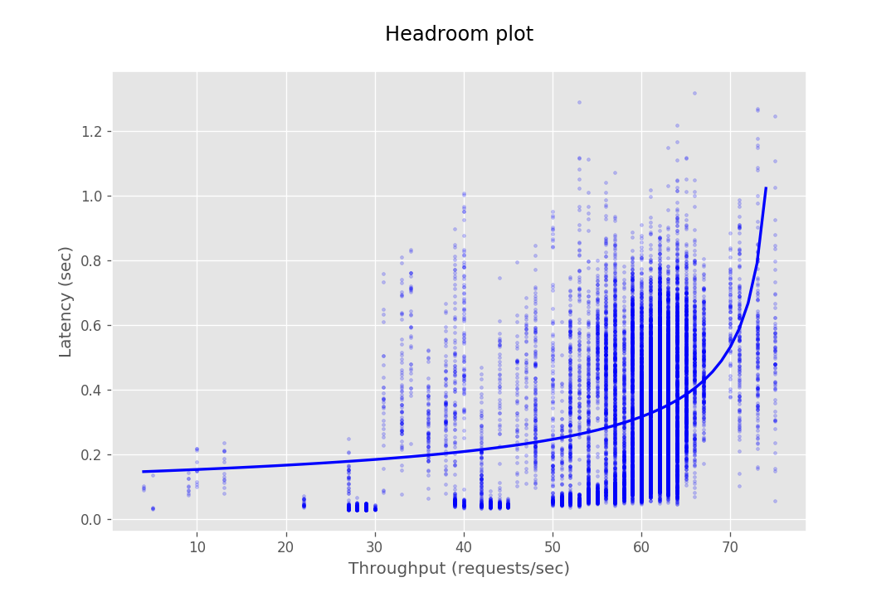
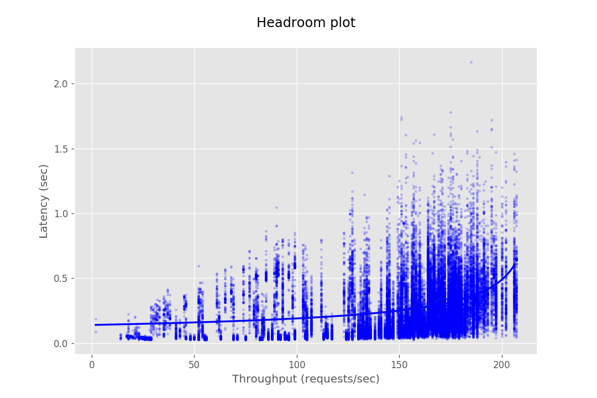
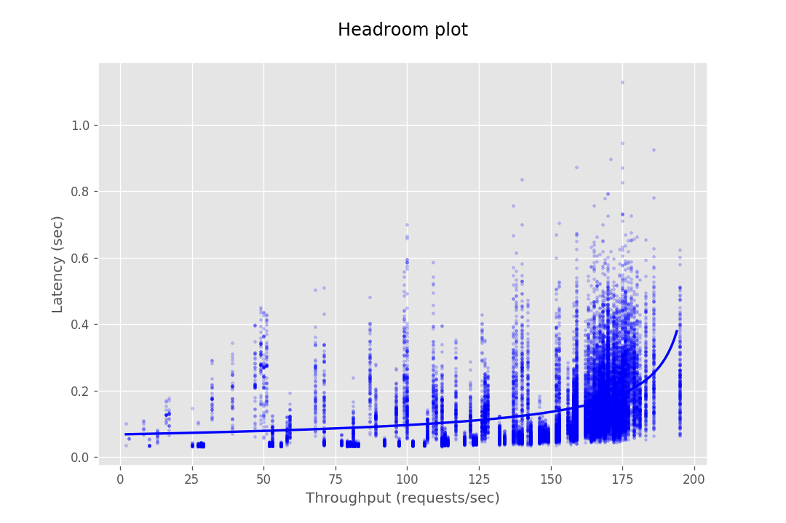
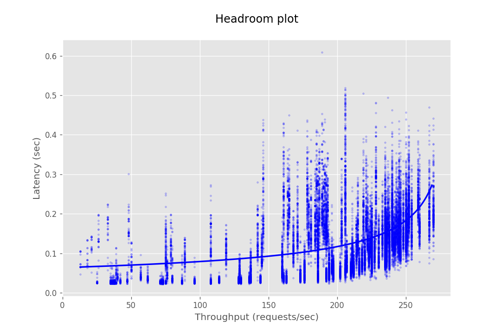
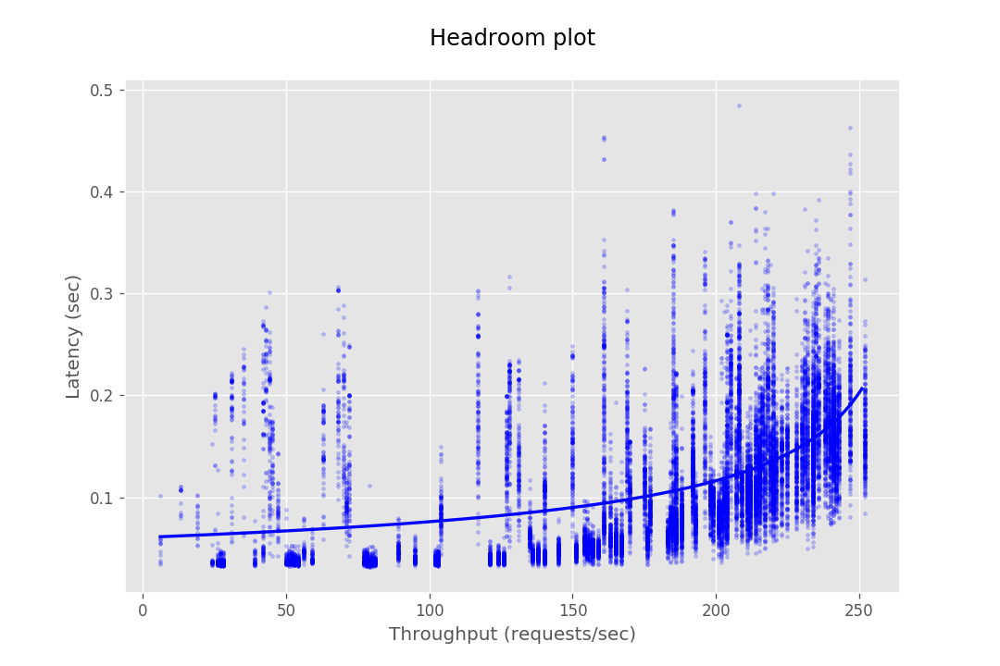

## Introduction

This document provides the configuration and results of a performance test of CredHub. The results should illustrate the baseline performance of a single instance, as well as the performance of a cluster of application instances as they scale horizontally. The result data are presented as [Headroom Plots][1]. These graphs show an average request latency for a given throughput. This information should inform the instance scale required to achieve a target latency based on an expected throughput requirement. 

[1]:https://github.com/adrianco/headroom-plot

## Benchmarking Setup 

Our intention for the performance test is to validate the performance of the CredHub application itself. For this reason, the test was setup to minimize external factors. For example, we have chosen to over provision the backing database and to configure the network to minimize latency. Your results may be affected by these factors if your environment does not allow this setup. 

The performance test consists of sending requests at gradually increasing levels of concurrency. The test tools are packaged as a BOSH release and deployed to a dedicated VM. Each request authenticates with CredHub via mutual TLS and performs a command, e.g. getting or setting a credential. The response latency is captured and stored in a CSV file. This CSV is then loaded into a plotting library to generate a headroom plot to visualize the data.

#### Tools

* **[Hey][2]**: A golang tool which load tests a given endpoint with a given number of requests at a given concurrency and prints the results in a csv file. We use a forked version of hey that enables mtls and start time measurement.
* **[Matplotlib][3]**: A python graph plotting library which is utilized to generate a headroom plot with data obtained from a provided CSV file.
* **[CredHub Perf Release][4]**: A BOSH release which packages Hey to create load from a deployed instance. 

[2]:https://github.com/cf-routing/hey
[3]:https://github.com/matplotlib/matplotlib
[4]:https://github.com/cloudfoundry-incubator/credhub-perf-release

#### CredHub Instance(s)

| Property              | Value      | 
|-----------------------|------------|
| Instance Type         | m4.large   |
| CPU                   | 2 core     |
| RAM                   | 8 GiB      |
| Encryption Provider   | Internal   |
| Authentication        | Mutual TLS |
| CredHub Max Heap Size | 7 GB       |
| Database TLS Enabled  | False      |
| CredHub ACLs Enabled  | False      |

#### Database Instance

| Property          | Setting           |
|-------------------|-------------------|
| Instance Type     | RDS db.m4.2xlarge |
| CPU               | 8 core            |
| RAM               | 32 GiB            |
| Allocated Storage | 50 GiB            |
| Engine            | Postgres 9.4.11   |
| Multi AZ          | False             |
| Storage Type      | gp2               |

#### Testing Instance

| Property          | Setting  |
|-------------------|----------|
| Instance Type     | m4.large |
| CPU               | 2 core   |
| RAM               | 8 GiB    |

#### Network Setup

All the VMs are deployed in the same AZ on AWS. The CredHub instances are deployed behind an AWS elastic load balancer. The database is in the same AWS region, however, the instances access it via a public address.  

The client and server TLS connections are terminated in the application and not in load balancers or a TLS termination proxy.

#### Data Configuration

Before every run of the performance test, the database is seeded with the JSON credentials which shall be tested against.
After every run of the performance test, the database is truncated to ensure each run is clean and unaffected by previous runs.

## Performance Results

#### Request Details 

A single credential is set or retrieved in the get and set request tests. The interpolate tests retrieve and interpolate 3 credential values into a request json object per request. 

| Request Type |  Instances | Number of Requests/Step | Concurrency Step | Min Concurrency | Max Concurrency | Total Requests | 
|------|-----|------|-------|-------|------|------|
| Get         | 1  | 500 | 1 | 1 | 60  | 30000
|             | 2  | 500 | 1 | 1 | 60 | 30000 
|             | 4  | 500 | 1 | 1 | 60 | 30000 
|             | 10 | 500 | 1 | 1 | TBD | TBD 
| Set         | 1  | 500 | 1 | 1 | 35 | 17500
|             | 2  | 500 | 1 | 1 | TBD | TBD 
|             | 4  | 500 | 1 | 1 | TBD | TBD 
|             | 10 | 500 | 1 | 1 | TBD | TBD 
| Interpolate | 1  | 500 | 1 | 1 | 50 | 25000
|             | 2  | 500 | 1 | 1 | 50 | 25000 
|             | 4  | 500 | 1 | 1 | 50 | 25000 
|             | 10 | 500 | 1 | 1 | TBD | TBD 

#### Results

| Instances |  Get | Set | Interpolate |
|------|-----|------|-----|
| 1  |  |  |  |
| 2  |  | |  |
| 4  |  | |  |
| 10 | | | |

## How to build your own Headroom Plot

The tools required to performance test the Credhub performance setup are available [here.](https://github.com/cloudfoundry-incubator/credhub-perf-release)

Follow the instructions provided in the [README](https://github.com/cloudfoundry-incubator/credhub-performance/blob/master/README.md) to both run the tests and process the test output into Headroom Plots. 
