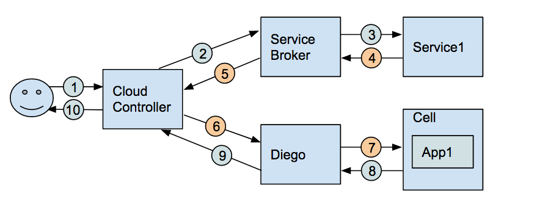
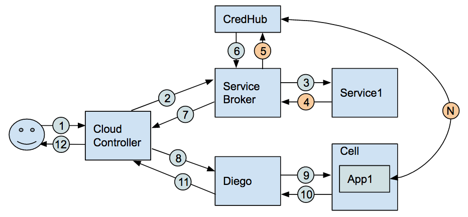

# Secure Service Credential Delivery

### Description
Cloud Foundry implements a mechanism for provisioning services known as a [service broker][1]. This implementation enables a self-service model that allows developers to provision access to a service, e.g. a database, for use by an application. This is also referred to as binding an application to a service. The underlying mechanics of provisioning a tenant or deploying a dedicated instance of the service for the application are transparent to the developer.

A simplified view of the workflow for binding an application to a service is shown below.



1. User requests to bind Service1 to App1
2. Cloud Controller send bind request to Service Broker
3. Service Broker provisions service credentials with service
4. Service returns credential values
5. Service Broker returns 'VCAP_SERVICES' data containing credential values to Cloud Controller
6. Cloud Controller sends 'VCAP_SERVICES' data containing credential values to Diego
7. Diego places data containing credential values into App1 environment
8. Success response
9. Success response
10. Success response

[1]:https://docs.cloudfoundry.org/services/overview.html

### Motivation
The service binding workflow is a very compelling feature for operators and developers. However, some users have expressed concerns about the delivery workflow of service credentials in the current model.

* Leaking environment variables to logs increase risk of disclosure

    Developers often need to write environment variables to logs for debugging. If environment variables are written to logs for an application that has bound to a service, the service credentials will be included in logs. Log files tend to have less access control than application environments, so this increase the likelihood of disclosing the credentials.

* Transiting credentials between components increases risk of disclosure

    The current model passes a service credential from the service broker through the cloud controller to the runtime to be places in the application environment. As more components interact are involved, the risk of disclosure increases.

* Rotating credentials delivered via the environment require container recreation

    If you wish to rotate a credential delivered via environment variables, the container must be recreated. This requirement creates friction in an environment with short-lived credentials, because credential rotation incurs an overhead cost on the plaform due to increased lifecycle events. This encourages long-lived credentials, which increases the risk of disclosure.

### Implementation

To address the above concerns, we have created an alternative workflow that allows service brokers to write and applications to retrieve service credentials directly via CredHub. This modified workflow reduces the requests containing credentials to only those essential to the process.

#### Updated Service Workflow



1. User requests to bind Service1 to App1
2. Cloud Controller send bind request to Service Broker
3. Service Broker provisions service credentials with service
4. Service returns credential values
5. Service Broker sets credential value into CredHub with access control allowing App1 to read the value
6. Success response
7. Service Broker returns 'VCAP_SERVICES' data containing CredHub reference to Cloud Controller
8. Cloud Controller sends 'VCAP_SERVICES' data containing CredHub reference to Diego
9. Diego places data containing CredHub reference into App1 environment
10. Success response
11. Success response
12. Success response

#### Service Brokers

Service brokers that support binding of service instances to applications typically return a set of binding credentials in response to a binding request from Cloud Controller (CC). These binding credentials must be returned to CC in the form of a JSON hash so they can be provided to bound applications. The keys and values in the credentials hash are typically plain-text.

If a service instance provisioned by a service broker were accessed by applications using an HTTP URI secured by basic authentication, the credentials returned from a binding request might look like this:

```
{
  "credentials": {
    "uri": "https://my-service.cf.example.com",
    "username": "user",
    "password": "secret"
  }
}
```

When integrated with CredHub, a service broker should store the binding credentials in CredHub using the “set credential” API with a credential type “json”. The name given to the credential should adhere to the following convention to ensure uniqueness within CredHub:

```
/c/client-identifier/service-identifier/binding-guid/credential-name
```

where:
* `client-identifier` is a value provided by the service broker to uniquely identify the broker
* `service-identifier` is the name of the service offering as shown in the services catalog
* `binding-guid` is the GUID created by CC and passed to the service broker in the service binding request
* `credential-name` is a value provided by the service broker to name the credential

Following the previous service binding example of service binding credentials containing a basic-auth secured URI, a `curl` request to CredHub to store credentials might look like this:

```
curl "https://credhub.cf.example.com/api/v1/data" \
  -X PUT \
  -d '{
      "name": "/c/my-service-broker/my-service/faa677f5-25cd-4f1e-8921-14a9d5ab48b8/credentials",
      "type": "json",
      "value": {
        "uri": "https://my-service.cf.example.com",
        "username": "user",
        "password": "secret"
      }
     }' \
  -H 'Content-type: application/json'
```

A service broker should return a reference to these stored credentials in response to a binding request from CC. To facilitate retrieval of the credentials by bound applications, the credentials returned to CC should contain the single key “credhub-ref”, and the name of the stored credential as the value for that key. That binding response might look like this:

```
{
  "credentials": {
    "credhub-ref": "((/c/my-service-broker/my-service/faa677f5-25cd-4f1e-8921-14a9d5ab48b8/credentials))"
  }
}
```

#### Client Applications

Applications that are bound to services are provided with a VCAP_SERVICES environment variable that contains the binding credentials supplied by the service broker. If an application were bound to the service used in the examples above, without CredHub integration the application’s VCAP_SERVICES environment variable might look like this:

```
{
  "my-service": [
   {
    "credentials": {
      "uri": "https://my-service.cf.example.com",
      "username": "user",
      "password": "secret"
    },
    "label": "my-service",
    "name": "my-service-instance",
    "plan": "standard",
    "tags": [],
    "volume_mounts": []
   }
  ]
}
```

If a service broker has stored credentials in CredHub and returned a CredHub reference in the binding credentials, the application’s VCAP_SERVICES might instead look like this:

```
{
  "my-service": [
   {
    "credentials": {
      "credhub-ref": "((/c/my-service-broker/my-service/faa677f5-25cd-4f1e-8921-14a9d5ab48b8/credentials))"
    },
    "label": "my-service",
    "name": "my-service-instance",
    "plan": "standard",
    "tags": [],
    "volume_mounts": []
   }
  ]
}
```

To be able to connect to the service, the application needs to exchange the CredHub reference for the raw credentials. This can either be done by making a request for each referenced credential or by using the CredHub [interpolation API.](https://credhub-api.cfapps.io/#interpolate-endpoint-beta) The entire VCAP_SERVICES environment variable is passed to the API. CredHub responds with the entire VCAP_SERVICES structure, with any credhub-ref fields in the credentials replaced with the raw credentials stored by the service broker.

After the bind workflow has completed, the app is able to access the credential values on-demand via a request to CredHub. This process may be automated using client libraries, such as [Spring CredHub.](../spring-java-credhub-integration.md)

#### Authentication

All interactions with CredHub must be authenticated. CredHub supports authentication via [UAA][2] and [mutual TLS](mutual-tls.md).

Service brokers that are deployed as Cloud Foundry applications are recommended to use the [instance identity credentials][3]. Service brokers that are deployed as a platform instance or third party service must use a UAA client credential.

Applications must authenticate with CredHub using the application instance identity credentials.

Instance identity credentials are provisioned and rotated automatically in the application container. CredHub will validate the [authenticated identity](authentication-identities.md), signing authority, validity dates and presence of x509 extension Extended Key Usage 'Client Authentication' during the authentication workflow.


[2]:https://github.com/cloudfoundry/uaa
[3]:https://github.com/cloudfoundry/diego-release/blob/master/docs/instance-identity.md

#### Authorization

Credential access in CredHub is controlled via access control lists. Each credential contains a list of permitted operation allowance for users. For each request, the ACL is validated to determine whether a user is authorized to perform the requested operation.

When a new credential is created, the creator is granted full access to the credential. In this workflow, the service broker will originate all service binding credentials and, therefore, receive full access. In the request to store the credential, the service broker will include an entry to authorize the app in the bind request to read the credential value.

This authorization workflow will enforce appropriate controls so that only the originating service broker and bound app are able to access the stored service credentials.

### Deployment Configuration

Deployment configuration is [described here.](https://github.com/pivotal-cf/credhub-release/blob/master/docs/secure-service-credentials.md)

